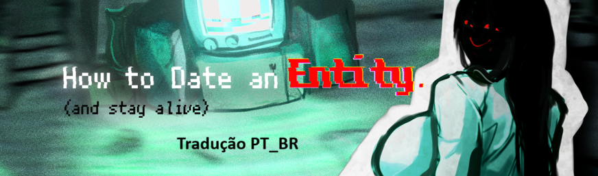

<div  align="center">

</div>
<hr />

📁 No ../games/screens.rpy, eu adicionei a seguinte linha de código para opção ficar disponível:
```
#Após a última opção de tradução
        null height 8         

        vbox:
            spacing 5
            textbutton "Português" text_style "language_chooser_button_text" action [Language("portuguese"), Jump("after_language_change")] xalign 0.5
            text _("credit: Cain-byte") size 20 color "#aaaaaa" xalign 0.5    

        null height 10
        textbutton _("Return") action ShowMenu("language_menu2") xalign 0.5
```
📌Esta tradução não possui fins comerciais nem está associada aos criadores do jogo. Trata-se de um trabalho gratuito, feito por fãs para outros fãs. Pedimos que respeite a propriedade intelectual original e utilize os canais oficiais para adquirir o produto.
